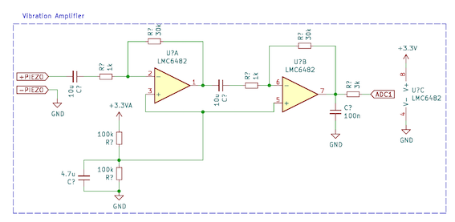

<p align="center">
  <strong><font size="+3">AUTO-TUNER</font></strong>
</p>
<p align="center">
  <font size="+1">An STM32-Based Automatic Guitar Tuner</font>
</p>


## About
The Auto-Tuner (AT) is a handheld device designed to automatically tune guitar strings one at a time. It operates by placing the tuning motor fork over one of the guitar’s tuning pegs and then plucking the corresponding string. The AT detects the string’s pitch through vibration sensing and adjusts the tuning peg until the string reaches the correct pitch.  Once the string is in tune, the device alerts the user by emitting two short vibration pulses. Click the thumbnail below to see it in action!

<p align="center">
  <a href="https://www.youtube.com/watch?v=4Ss6xfbAHeE">
    
  </a>
</p>

---

## Auto-Tuner V2
Since building the original Auto-Tuner, I’ve learned a lot and decided to rebuild this repository from the ground up with several key improvements. Version 1 remains available in the [legacy branch](TODO:link).

**Completed:**
- Full separation of application and driver logic — simpler to port to different MCUs using provided API templates 
- CMake-based build system  
- Optimised implementation of the McLeod Pitch Method (reduced from $84$ ms to $1.7$ ms)  
- Introduction of an adaptive noise gate  
- Expanded documentation explaining algorithm design decisions  

**Todo:**
- Improved pitch tracking with median and Kalman filtering (in progress)
- Motor PID controller 
- Display integration

**Future Improvements:**
- GUI system to allow custom string tunings
- Replace analog pre-amplifier with charge amplifier (better suited for piezo inputs)
- Integrated all analog circuitry on PCB to reduce size  
- 3D-printed enclosure
- Rechargeable LiPo power supply


---

## Building and Running
*Prerequisites:*  
- ARM GCC toolchain (`arm-none-eabi-gcc`)  
- CMake ≥ 3.15  
- OpenOCD (required for `make flash`)  
1. **Using My Setup**  
  - Order the [RaptorXL4 breakout board](https://github.com/b-ashford/RaptorXL4) (KiCad design files available in that repo)  
  - Connect a Piezo sensor to the ADC through a pre-amplifier that adds a DC bias of $3.3/2 \,\text{V}$, such as the example below:  
  - Connect a PWM-driven motor using either an H-bridge or a continuous rotation servo  
  (the demo video uses a **DF15RSMG 360° motor**) to pin **PA11**.  
  - Provide both a 3.3 V and a 5–6 V power source  
    (in the demo video: two AA batteries in series with an LDO regulator → 3.3 V).  


    

  - Clone the repository
   ```bash
   git clone https://github.com/b-ashford/Auto-Tuner.git
   cd Auto-Tuner
   ```
   - Configure with CMake and flash with OpenOCD via ST-Link
   ```bash
  cd build
  cmake -DCMAKE_TOOLCHAIN_FILE=cmake/arm-none-eabi-toolchain.cmake -DCMAKE_BUILD_TYPE=Release ..
  make -j$(nproc)
  make flash
   ```

2. **Using a Custom Board**  
To use a different board, create a new directory in `hw/boards/` following the naming convention shown below.  
Inside that directory, implement all the APIs defined in `board_api.h`.

```bash
hw/
├── boards/
│   ├── <my_board>/
│   │   ├── linker/
│   │   │   └── <my_board>_FLASH.ld    # Linker script
│   │   ├── <my_board>.cfg             # OpenOCD configuration
│   │   ├── <my_board>.cmake           # CMake toolchain file
│   │   ├── board_api.c                # Implementation of board APIs
│   │   └── board_api.h                # API definitions (template provided)
```

## Documentation
- **Implementation Details**
  - [McLeod’s Pitch Method](docs/mpm_direct.ipynb)
  - [Optimising McLeod’s Pitch Method](docs/mpm_optimisation.ipynb)
  - [Adaptive Noise Gate](docs/adaptive_noise_gate.ipynb)
  - [Pitch Tracking](docs/pitch_tracking.ipynb)
- **Reference Paper**
  - McLeod’s original paper, transcribed to Markdown:  
    [A Smarter Way to Find Pitch](docs/smarter_way_to_find_pitch.md)