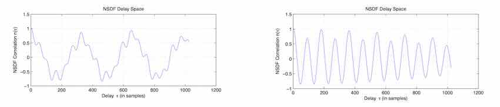
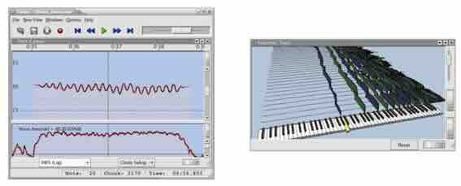

<h1 align="center">A SMARTER WAY TO FIND PITCH</h1>

<em>Philip McLeod, Geoff Wyvill</em> 
University of Otago 
Department of Computer Science 
pmcleod, geoff @cs.otago.ac.nz

<h2 align="center">ABSTRACT</h2>

The ’Tartini’ project at the University of Otago aims to use the computer as a practical tool for singers and instrumentalists. Sound played into the system is analysed fast enough to create useful feedback for teaching or, at a higher level, for practising musicians to refine their technique. Central to this analysis is the accurate determination of musical pitch.

We describe a fast, accurate and robust method for finding the continuous pitch in monophonic musical sounds. We employ a special normalised version of the Squared Difference Function (SDF) coupled with a peak picking algorithm. We show how to implement the algorithm efficiently. Inherent in our method is a ’clarity’ estimate that measures to what extent the sound has a tone. This has already found application in showing defects in a violinist’s bowing technique.  

<h2 align="center">1. INTRODUCTION</h2>

Over the last three years at the University of Otago we have been investigating ways to use a computer to analyse sound and provide useful, practical feedback to musicians, both amateur and professional. We have informally dubbed this activity the Tartini Project, named for the violinist and composer Guiseppe Tartini. In 1714, Tartini discovered that when two related notes were played simultaneously on a violin a third sound was heard. He taught his students to listen for this third sound as a device to ensure that their playing was in tune.

We are using visual feedback from a computer similarly to provide useful information to help musicians improve their art. Our system can help beginners to learn to hear musical intervals and professionals to understand some of the subtle choices they need to make in expressive intonation.

Pitch is the perception of how high or low a musical note sounds, which can be considered as a frequency which corresponds closely to the fundamental frequency or main repetition rate in the signal. Estimation of f0 has quite a history. It is used in speech recognition and music information retrieval, and in handheld ’tuners’ that help developing musicians to tune their instruments. Existing algorithms for pitch estimation include the Average Magnitude Difference Function (AMDF), Harmonic Product Spectrum (HPS), Log Harmonic Product Spectrum, Phase Vocoder, Channel Vocoder, Parallel Processing Pitch Detector [6], Square Difference Function (SDF) [1], Cepstral Pitch Determination [5], Subharmonic-to-harmonic ratio [8] and Super Resolution Pitch Detector (SRPD) [4]. 
We have already demonstrated that we can produce useful feedback in real time to musicians [3]. In particular, we have successfully displayed the shape of a professional violinist’s vibrato and helped at least one amateur violinist to develop smoother changes in bow direction. Once f0 is known, a full harmonic analysis of the sound becomes possible in real time and we can display many other aspects of a sound that are useful to a musician. In this paper, we deal only with the ’McLeod Pitch Method’ (MPM), our latest and much improved method of finding the fundamental pitch. 

MPM runs in real time with a standard 44.1 kHz sampling rate. It operates without using low-pass filtering so it can work on sound with high harmonic frequencies such as a violin and it can display pitch changes of one cent reliably. MPM works well without any post processing to correct the pitch. Post processing is a common requirement in other pitch detectors. 

The Tartini system has an option to equalise the levels of the signal to the sensitivity of the inner ear. Standard equal-loudness curves [7] are used, tending to reduce low frequencies not perceived well relative to frequencies around 3700 Hz heard best. This helps move from a direct fundamental frequency estimate towards something more correlated with pitch. 

Existing pitch algorithms that use the Fourier Domain suffer from spectral leakage. This is because the finite window chosen in the data does not always contain a whole number of periods of the signal. The common solution to this is to reduce the leakage by using a windowing function [2], smoothing the data at the window edges. This requires a larger window size for the same frequency resolution. A similar problem happens in some time domain methods, such as the autocorrelation, where a window containing a fractional number of periods, produces maxima at varying locations depending on the phase of the input. MPM however, introduces a method of normalisation which is less affected by edge problems. Keeping track of terms on each side of the correlation separately. 
To explain our fast calculation of the Normalised Square Difference Function (NSDF) it is necessary first to describe the relationship between an Autocorrelation Function (ACF) and the Squared Difference Function (SDF).

This we do in Sections 2 and 3. The fast calculation depends on a standard method for ACF [6]; how this is used is described in Section 6. The NSDF automatically generates an estimate of the clarity of the sound, describing how tone-like it is. This is basically the value of the chosen maximum of the function (section 7).

<h2 align="center">2. AUTOCORRELATION FUNCTION</h2>

There are a two main ways of defining the Autocorrelation Function (ACF). We will refer to them as type I, type II. When not specified we are referring to type II.

We define the ACF type I of a discrete signal $x_t$ as:

$$
r_t(\tau) = \sum_{j=t}^{t+W-1} x_j\,x_{j+\tau}
\tag{1}
$$

where $r_t(\tau)$ is the autocorrelation function of lag $\tau$ calculated starting at time index $t$, where $W$ is the initial window size, i.e the number of terms in the summation.

We will define the ACF type II as:

$$
r'_t(\tau) = \sum_{j=t}^{t+W-1-\tau} x_j\,x_{j+\tau}
\tag{2}
$$

In this definition the window size decreases with increasing $\tau$. This has a tapering effect, with a smaller number of non-zero terms being used in the calculation at larger $\tau$. Note that ACF Type I and Type II are the same for a zero-padded data set, i.e $x_k = 0$ for $k > t + W - 1$.

<h2 align="center">3. SQUARE DIFFERENCE FUNCTION</h2>

Again we define two types of discrete signal Square Difference Functions (SDFs). The SDF of Type I is defined as:

$$
d_t(\tau) = \sum_{j=t}^{t+W-1} (x_j - x_{j+\tau})^2
\tag{3}
$$

and the SDF Type II is defined as:

$$
d'_t(\tau)=\sum_{j=t}^{\,t+W-1-\tau}
\bigl(x_j - x_{j+\tau}\bigr)^2
\tag{4}
$$

As in Type II ACF, the window size decreases as we increase $\tau$. In both types of SDFs minima occur when $\tau$ is a multiple of the period, whereas in the ACFs maxima occurred. These do not always coincide. If we expand out Equation 4 we see that there is an ACF inside the SDF calculation.

$$
d'_t(\tau)=\sum_{j = t}^{\,t + W - 1 - \tau}
\bigl(x_j^2 + x_{j+\tau}^2 - 2\,x_j\,x_{j+\tau}\bigr)
\tag{5}
$$

If we define

$$
m'_t(\tau)=\sum_{j = t}^{\,t + W - 1 - \tau}
\bigl(x_j^2 + x_{j+\tau}^2\bigr)
\tag{6}
$$

we can see that

$$
d'_t(\tau) = m'_t(\tau) - 2\,r'_t(\tau)
\tag{7}
$$

When using the Type II ACF it is common to divide $r'_t(\tau)$ by the number of terms as a method of counteracting the tapering effect. However this can introduce artifacts, such as sudden jumps when large changes in the waveform pass out the edge of the window. Our normalisation method provides a more stable correlation function even down to a window containing just two periods of a waveform.

<h2 align="center">4. NORMALIZED SQUARE DIFFERENCE FUNCTION</h2>

Once the SDF has been calculated at time $t$, we have the central problem of deciding which is the $\tau$ that corresponds to the pitch. This does not always correspond with the overall minimum, but is usually one of the local minima. Without a grasp of the range of the values it is difficult to decide which minimum it corresponds to. We have discovered a useful way of normalizing the values to simplify this problem. We define a Normalised Square Difference Function (NSDF) as follows:

$$
n'_t(\tau) = 1 - \frac{m'_t(\tau) - 2\,r'_t(\tau)}{m'_t(\tau)}
\tag{8}
$$

$$
= \frac{2\,r'_t(\tau)}{m'_t(\tau)}
\tag{9}
$$

The greatest possible magnitude of $2\,r'_t(\tau)$ is $m'_t(\tau)$ i.e. $|2r'_t(\tau)| \le m'_t(\tau)$. This puts $n'_t(\tau)$ in the range of –1 to 1, where 1 means perfect correlation, 0 means no correlation and –1 means perfect negative correlation, irrespective of the waveform’s amplitude. From equation 9, we see this becomes the same as normalising the autocorrelation in the same fashion. Notice that $m'_t$ is a function of $\tau$, minimising the edge effects of the decreasing window size. Having these normalised values simplifies the problem of choosing the pitch period, as the range is well defined. We refer to the process of choosing the ’best’ maximum as peak picking, and our algorithm is shown in Section 5. But another reason for normalisation is that it enables us to define a clarity measure. Clarity is discussed in Section 7.

An important property we have found useful in a time domain pitch detection algorithm is what we call the Symmetry property. This means there are the same number of evenly spaced samples being used from either side of time $t$ for a given $\tau$, and that these samples are symmetric in terms of their distances from $t$. This maximises cancellations of frequency deviations from opposite sides of time $t$, creating a frequency averaging effect.

Equation 4 can be made to hold this property by simply shifting the center to $t$, yielding

$$
d'_t(\tau) \;=\; \sum_{j = t - \frac{W-\tau}{2}}^{t + \frac{W-\tau}{2} - 1} (x_j - x_{j+\tau})^2
\tag{10}
$$

  

**Figure 1.** A NSDF graph showing the highest key maximum at 650, whereas the pitch has a period at 325. The graph is sprinkled with other unimportant local maxima.

**Figure 2.** A graph showing the NSDF of a signal with a strong second harmonic. The real pitch here has a period of 190. But close matches are made at half this period.

<h2 align="center">5. PEAK PICKING ALGORITHM</h2>
The algorithm so far gives us correlation coefficients at integer $\tau$. We will choose the first ‘major’ peak as representing the pitch period. This is not always the maximum, which is considered the fundamental frequency. Firstly, find all of the useful local maxima. These are maxima with $\tau$ which potentially represent the period associated with the pitch. We will refer to these as key maxima. As can be seen from Figure 1, if we just take all the local maxima we get a lot of unnecessary peaks which are not of much use. We find that taking only the highest maximum between every positively sloped zero crossing and negatively sloped zero crossing works well at choosing key maxima. The maximum at delay 0 is ignored, and we start from the first positively sloped zero crossing. If there is a positively sloped zero crossing toward the end without a negative zero crossing, the highest maximum so far is accepted, if one exists.

In the example from Figure 1 this leaves us with three key maxima. It is possible to get some spurious peaks as key maxima: for example if the value at $\tau = 720$ had crossed through the zero line then it would add another maximum to our key list. But these are normally a lot smaller than the other key maxima, so are not chosen in the later part of the algorithm.

Parabolic interpolation is used to find the positions of the maxima to a higher accuracy. This is done using the highest local value and its two neighbours.

From the key maxima we define a threshold which is equal to the value of the highest maximum, $n_{\max}$, multiplied by a constant $k$. We then take the first key maximum which is above this threshold and assign its delay, $\tau$, as the pitch period. The constant, $k$, has to be large enough to avoid choosing peaks caused by strong harmonics, such as those in Figure 2, but low enough to not choose the unwanted beat or sub-harmonic signals. Choosing an incorrect key maximum causes a pitch error, usually a ‘wrong octave’. Pitch is a subjective quantity and impossible to get correct all the time. In special cases, the pitch of a given note will be judged differently by different, expert listeners. We can endeavour to get the pitch agreed by the user/musician as most often as possible. The value of $k$ can be adjusted to achieve this, usually in the range 0.8 to 1.0.

The pitch period is equal to the delay, $\tau$, at the chosen key maximum. The corresponding frequency is obtained by dividing the sample rate by the pitch period (in samples). We turn this into a note on the even tempered scale using:

$$
\text{note} = \frac{\log_{10}(f/27.5)}{\log_{10}(\sqrt{2})}
\tag{11}
$$

These correspond to notes on the MIDI scale, and contain decimal parts representing fractions of a semitone.  

<h2 align="center">6. EFFICIENT CALCULATION OF SDF</h2>

To calculate the SDF by summation takes $O(W\,w)$ time, where $w$ is the desired number of ACF coefficients. By splitting $d'_t(\tau)$ into the two components $m'_t(\tau)$ and $r'_t(\tau)$, we can calculate these terms more efficiently. The ACF part of the SDF can be calculated in approximately  
$$
O\bigl((W + w)\,\log(W + w)\bigr)
$$  
time by use of the Fast Fourier Transform (FFT). The ACF component $r'_t(\tau)$ can be calculated as follows:

1. Zero pad the window by the number of NSDF values required, $w$. We use $w = W/2$.
2. Take a Fast Fourier Transform of this real signal.
3. For each complex coefficient, multiply it by its conjugate (giving the power spectral density).
4. Take the inverse Fast Fourier Transform.

The two terms of $m'_t(\tau)$ from Equation 6 can each be calculated incrementally, by simply using the result from $\tau-1$ and subtracting the appropriate $x_j^2$ (starting, when $\tau=0$, with both sums equal to the total sum of squares of the whole window, which we already have in $r'_t(0)$).

Typical window sizes we use for a 44 100 Hz signal are 512, 1024, 2048 or 4096 samples, with 75 % overlap in time, i.e incrementing $t$ by $W/4$.

<h2 align="center">7. THE CLARITY MEASURE</h2>
We define clarity as a measure of how coherent a note sound is. If a signal contains a more accurately repeating waveform, then it is clearer. This is similar to the term voiced, used in speech recognition. Clarity is independent of the amplitude or harmonic structure of the signal. As a signal becomes more noise-like, its clarity decreases toward zero. The clarity is simply taken as the correlation value of the chosen key maximum. If no key maxima are found, it is set to zero.

We use the clarity measure in combonation with the RMS power to weight the alpha value (translucency) of the pitch contour at a given point in time. This maximises the on-screen contrast, displaying the pitch information most relevant to the musician. The clearer the sound the larger the weight and the louder the sound the larger the weight. This ensures that background sounds and non- musical sounds are not cluttering the display, but are faded into the background. Sounds below the noise threshold level are completely ignored.

  

**Figure 3.** Two screen-shots from Tartini. (a) A pitch contour and log-RMS plot of a Violin vibrato about a D on the 5th octave. (b) Harmonic tracks from a descending scale beside their equivalent key on a keyboard.

<h2 align="center">8. CONCLUSION</h2>

The MPM algorithm can provide real-time pitch contours. With its ability to extract pitch with as little as two periods, smaller window sizes can be used than in other algorithms. Smaller window sizes allow for better representation of a changing pitch, such as that during vibrato. Tartini works well on a range of instruments including string, woodwind, brass and voice.  

Tartini emphasises the importance of a loud and clear pitch by adjusting the alpha of the pitch contours (Section 7), thus hiding away unwanted background or pitch-less sounds. This can be seen in figure 3(a) where the pitch contour fades out at either end. Also, the rate and steadiness of vibrato can be seen. This direct feedback allows a musician to see where they are going wrong, or to get the effect they want. Breaks in playing, for example when a violinist changes bow direction, can be seen as a break in the contour. A violinist can practice shortening the break, helping to improve the bowing gesture. Figure 3(b) is a screen-shot showing the strength of each harmonic as a track, during a descending violin scale. This is done using the pitch as a basis for the harmonic analysis. A number of musicians and singers have shown great interest in the system. Tartini can be downloaded from www.tartini.net.  

<h2 align="center">9. ACKNOWLEDGEMENTS</h2>

We would like to thank our professional musicians, Mr Kevin Lefohn (violin) and Miss Judy Bellingham (voice) for numerous discussions and providing us with samples of good sound. Also we thank Dr Don Warrington of the Physics Department, University of Otago for his advice and encouragement.  

<h2 align="center">10. REFERENCES</h2>

[1] Cheveigne, A. “YIN, a fundamental frequency estimator for speech and music”, *Journal of the Acoustical Society of America*, Vol 111(4), pp 1917–1930, April 2002.  

[2] Harris, F. “On the Use of Windows for Harmonic Analysis with the Discrete Fourier Transform”, *Proc. of the IEEE*, Vol 66, No 1, Jan 1978.  

[3] McLeod, P., Wyvill, G. “Visualization of Musical Pitch”, *Proc. Computer Graphics International*, Tokyo, Japan, July 9–11, 2003, pp 300–303.  

[4] Medan, Y., Yair, E., and Chazan, D. “Super Resolution Pitch Determination of Speech Signals”, *IEEE Tans. Signal Processing*, Vol 39(1), pp 40–48, 1991.  

[5] Noll, A. “Cepstrum Pitch Determination”, *Journal of the Acoustical Society of America*, Vol 41(2), pp 293–309, 1967.  

[6] Rabiner, L., Schafer, R. *Digital Processing of Speech Signals*, Prentice Hall, 1978.  

[7] Rossing, T. *The Science of Sound*, 2nd ed., Addison Wesley, 1990.  

[8] Sun, X. “Pitch determination and voice quality analysis using subharmonic-to-harmonic ratio”, *Proc. of IEEE International Conference on Acoustics, Speech, and Signal Processing*, Orlando, Florida, May 13–17, 2002.  